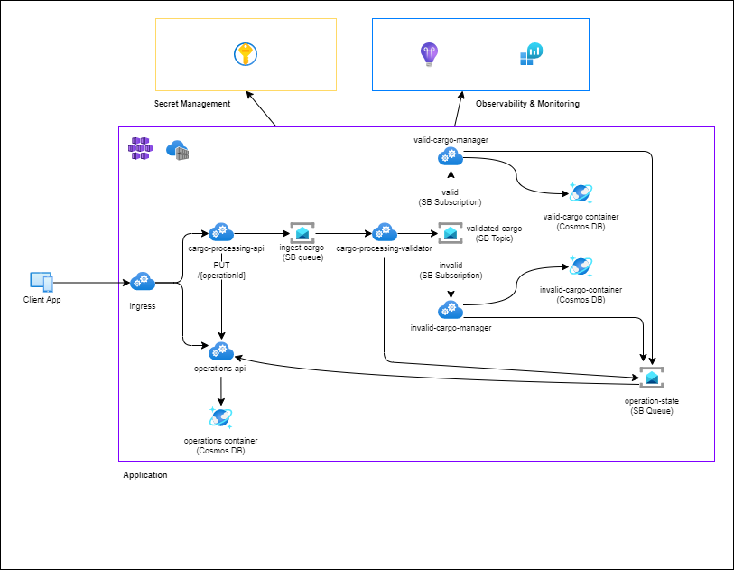

# Azure Monitor in a Message Based Distributed Application

Using Azure Monitor to observe a distributed application comes with unique challenges and considerations. The ability to generate and view traces, ensure service availability, use custom telemetry to track business critical indicators, etc. are all more complex in a distributed environment. The sample is designed to demonstrate how to automatically and manually instrument data in variety of languages within a distributed application, as well as provide similar examples for visualization and alerts based on this incoming data.

The sample contains a conceptual cargo processing application to demonstrate these points. The microservice-based solution is deployed to Azure Kubernetes Service and employs multiple communication protocols, including HTTP and message-based interactions, to enable seamless communication between its services. The services cover a wide variety of programming languages and instrumentation libraries - the Java services utilize OpenTelemetry exporters, while the Node, .NET, and Python services use the Application Insights SDKs for instrumentation purposes.

The sample contains all code and documentation necessary to deploy and monitor the application. Source code for the microservices can be found in the [/src](./src/) folder, while Bicep and Terraform versions (identical output) of the supporting infrastructure can be found in the [/infrastructure/bicep](./infrastructure/bicep/) and [/infrastructure/terraform](./infrastructure/bicep/) folders, respectively.

## Use Case

A `cargo-processing-api` service (Java) receives a PUT request with an object in the request body containing ports, products, and other cargo related information. The api validates the request schema and places a message containing the cargo object on an Azure Service Bus queue. A `cargo-processing-validator` service (Typescript) validates the internal cargo properties to ensure it can be successfully shipped before placing the cargo object with boolean validation result on a Service Bus topic. Finally, two services (.NET and Python) with subscriptions to the topic receive the final message, filtering for `valid = True` or `valid = False` flags, respectively, before storing the message in a dedicated Cosmos DB container for further processing.

A fifth, `operations-api` service (Java) implements the [async request-reply](https://learn.microsoft.com/azure/architecture/patterns/async-request-reply) pattern, adding a level of resiliency to the long running operation.

Each microservice sends telemetry data to Application Insights, while AKS, Key Vault, Cosmos DB, and Service Bus are each configured to export telemetry data directly to the Log Analytics Workspace associated with the Application Insights resource.

## Docs

Getting started instructions and documentation on observability and monitoring topics within the application can be found in the following pages:

| Topic                                   | Content                                                                                         |
| --------------------------------------- | ----------------------------------------------------------------------------------------------- |
| Getting Started                         | [getting-started.md](./docs/getting-started.md)                                                 |
| Auto vs Manually Instrumented Telemetry | [auto-vs-manually-instrumented-telemetry.md](./docs/auto-vs-manually-instrumented-telemetry.md) |
| Distributed Tracing                     | [distributed-tracing.md](./docs/distributed-tracing.md)                                         |
| Health Checks                           | [health-checks.md](./docs/health-checks.md)                                                     |
| Custom Dimensions                       | [custom-dimensions.md](./docs/custom-dimensions.md)                                             |
| Custom Metrics                          | [custom-metrics.md](./docs/custom-metrics.md)                                                   |
| Workbooks                               | [workbooks.md](./docs/workbooks.md)                                                             |
| Alerts                                  | [alerts.md](./docs/alerts.md)                                                                   |
| Introducing Chaos                       | [introducing-chaos.md](./docs/introducing-chaos.md)                                             |
| Reducing Telemetry Volume               | [reducing-telemetry-volume.md](./docs/reducing-telemetry-volume.md)                             |
