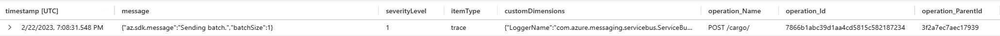
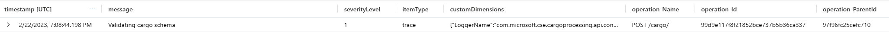
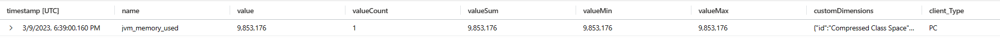
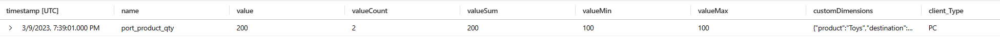
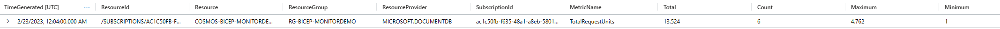
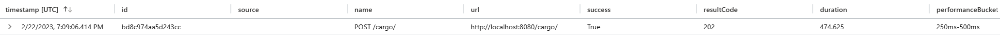
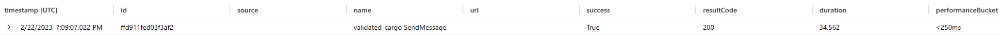

# Auto vs Manually Instrumented Telemetry

The telemetry data generated by the application can be separated into two distinct groups - automatically and manually instrumented data.

Automatically instrumented logs, metrics, and traces are produced by the application without any addition of custom code. Each exporter or SDK auto-instruments a unique set of telemetry data. The Java-based API services that utilize OpenTelemetry exporters for Azure Monitor, for instance, instrument a significant amount of telemetry data, by default, while the Typescript-based `cargo-processing-validator` service uses Application Insights SDK setup methods to [define the level of auto-instrumentation](../src/cargo-processing-validator/src/index.ts). Each SDK/exporter defines its own set of [auto-collected items](https://opentelemetry.io/docs/instrumentation/java/automatic/) for review.

Much of the telemetry we depend on for visualization or alert functionalities is generated out-of-the-box by the services in the application. Distributed tracing, for instance, depends on a number of spans produced automatically by these services. The Azure resources that support the application like Cosmos DB, Service Bus, Key Vault, etc. automatically export additional data that are used in Workbooks and Alert rules, like the number of dead-lettered messages in each queue and topic subscription.

Manually instrumented data refers to the data generated via custom code added to one of the microservices. The exporters and SDKs expose various methods to produce telemetry data in order to augment the initial, automatically instrumented set. It fills in the gaps that auto-instrumented data fails to provide. The set of auto-instrumented data generated by the application was first examined before determinations were made about what additional data was required to support the proposed Workbooks tiles and Alert rules. We elected to manually instrument data that enabled distributed traces, additional logging for debugging purposes, health checks, tracking of specific business rules, and more.

The following examples display automatically and manually instrumented logs, metrics, and trace data in Azure Monitor that was exported by the application:

The `cargo-processing-api` service automatically instruments a log related to sending a batch of messages, while the "Validating cargo schema" log results from a `logger.info()` call within its [CargoController](../src/cargo-processing-api/src/main/java/com/microsoft/cse/cargoprocessing/api/controllers/CargoController.java) class:

The `jvm_memory_used` metric is automatically instrumented by the `cargo-processing-api` service, while the `port_product_qty` custom metric is [manually instrumented within](../src/valid-cargo-manager/Services/SubscriptionReceiver.cs) the `valid-cargo-manager` service:

The `TotalRequestUnits` metric is automatically instrumented by the Cosmos DB resource:

The span that represents the initial POST request to the `cargo-processing-api` is automatically instrumented. The message send dependency to the `validated-cargo` Service Bus topic is represented by a manually instrumented span [generated within](../src/cargo-processing-validator/src/services/ServiceBusWithTelemetry.ts) the `cargo-processing-validator` service:

