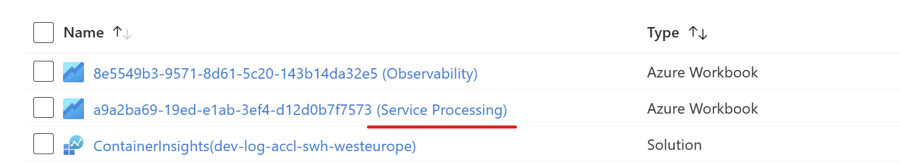
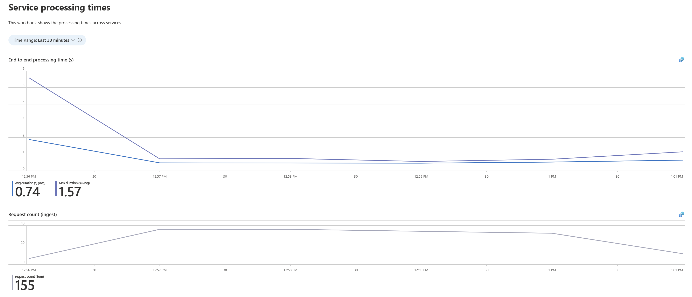
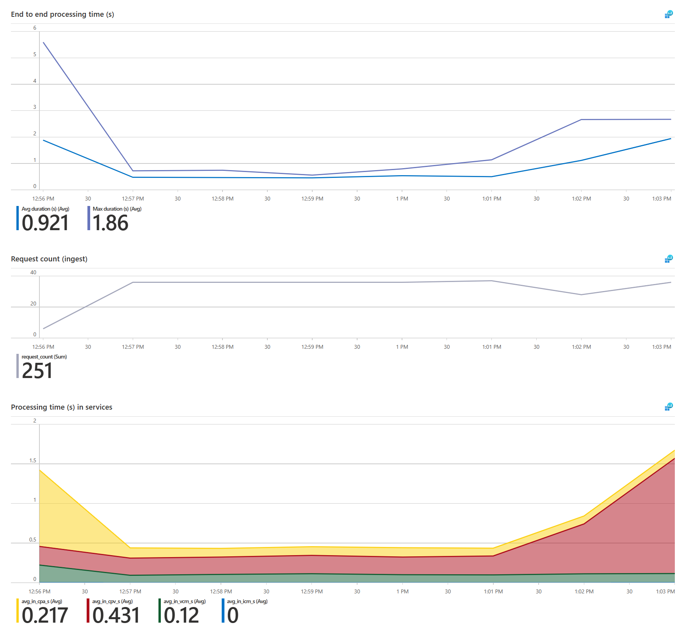
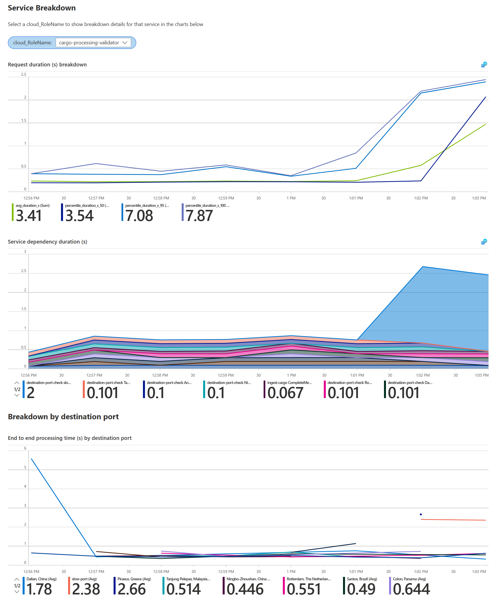

# Custom Dimensions

When examining the behavior of a system, we often find aspects that we want to explore more deeply. For example, if we see that some requests in the system are taking longer than expected we may want to know more about the specific requests that are slow. Are all requests slow or just some of them? Are there common features to the slow requests? Do the requests all come from a particular system? In a multi-tenant system, are the slow requests distributed across all tenants or just a subset?

As we explore these questions, we may find that we need to filter our telemetry data by additional properties. For example, we may want to filter our telemetry data by the request path, or by the tenant ID. Some of these properties will be available in the telemetry data by default, but others will not. For the properties that aren't part of the default data collected, we can use custom dimensions to add the additional information to our telemetry data.

One place where we add custom dimensions in this project is in the `cargo-processing-validator` service. In the next couple of sections we will see what the custom dimensions look like from the monitoring dashboard and explore the implementation in code.

## Custom Dimensions in Action

In this section we will generate some test load on the system and then explore the telemetry dashboard to see the custom dimensions in action.

To generate the test load, we will use the code in `src/cargo-test-scripts`. That folder contains a dev container for use with Visual Studio Code which makes it easy to run the scripts. If you are using Visual Studio Code, you can open the folder in a dev container by selecting the `Open Folder in Container` option from the `File` menu. The folder also contains a [README.md](../src/cargo-test-scripts/README.md) file with instructions for running the scripts from the command line.

From the terminal in the dev container, run the following command to generate some test load:

```bash
cat << EOF | node index.js -c -
{
    "tests": [
        {
            "name": "Send cargo to cargo processing api",
            "target": "cargo-processing-api",
            "volume": 500,
            "validateResults": false,
            "delayBetweenCargoInMilliseconds": 1500,
            "startingRetryBufferInMilliseconds": 300,
            "properties": {
                "chanceToInvalidate": 0

            }
        }
    ]
}
EOF
```

This command will generate 500 cargo messages and send them to the `cargo-processing-api` service. The cargo messages will be sent at a rate of one message every 1.5 seconds. The cargo messages will not be validated, so all of them will be sent to the `valid-cargo-manager` service.

Now that we are sending load, we can open the Once you have this running, open the [Azure portal](https://portal.azure.com) and navigate to the resource group you deployed to. Next, select the `Service Processing` Workbook as shown below:



Next, click the `Open Workbook` button. You should see a screen similar to the following (if you don't see any telemetry then ):



The top chart in the diagram above shows the end-to-end processing time for a cargo message and the chart below it shows the number of requests.

Now that we have some baseline load through the system, kill the previous load command by pressing `Ctrl+C`, and run the following command instead:

```bash
cat << EOF | node index.js -c -
{
    "tests": [
        {
            "name": "Send cargo to cargo processing api with 50% chance of slow port",
            "target": "cargo-processing-api",
            "volume": 500,
            "validateResults": false,
            "delayBetweenCargoInMilliseconds": 1500,
            "startingRetryBufferInMilliseconds": 300,
            "properties": {
                "chanceToInvalidate": 0,
                "chaosSettings": [
                    {
                        "target": "cargo-processing-api",
                        "type": "slow-port",
                        "chanceToCauseChaos": 2,
                        "isEnabled": true
                    }
                ]
            }
        }
    ]
}
EOF
```

This command will generate and send cargo messages as before, but this time with a 50% chance that the destination port will be set to `slow-port`. The code in the `cargo-processing-validator` service has code that simulates making a call to a service at the destination port. When the the port is `slow-port` the simulation adds an extra delay.

Now that we have some load that includes the `slow-port`, we can go back to the `Service Processing` Workbook and refresh the data. You should see a screen similar to the following:



In the top chart we can see a slight increase in the overall processing time. The chart below shows that the number of requests hasn't increased. Continuing down the charts, the bottom chart shows that the increase in processing time is due to the `cargo-processing-validator` service.

Further down the workbook we have the "Service Breakdown" section which allows us to drill into telemetry for each of the services. From the `cloud_RoleName` dropdown, select `cargo-processing-validator` and you should see a screen similar to the following:



The top chart in the "Service Breakdown" section shows the request breakdown for the selected service (mean, median, max and 95%th centile durations) and this confirms that the increase in processing time is due to the `cargo-processing-validator` service. The chart below shows the dependency breakdown for the selected service. Looking at this chart we can see that the dependency for the simulated call to the destination port service looks normal for all ports apart from the `slow-port`.
The final chart shows the end-to-end processing time broken out by destination port, and this also highlights the increase in processing time for the `slow-port`.

## Implementing Custom Dimensions in cargo-processing-validator

In this section we will look at the code in the `cargo-processing-validator` service to see how the custom dimensions are implemented. The code for the `cargo-processing-validator` service is in the `src/cargo-processing-validator/src` folder.

When a message is received from Service Bus, a `request` telemetry item is started. The code that does this is unaware of the content of the messages, so it only attaches standard fields on the telemetry item. There are two steps to adding custom dimensions to the telemetry item. First, we obtain the telemetry correlation context and set the custom properties. Secondly, we use a telemetry processor to modify the telemetry items before they are sent to Application Insights.

The code below (from `services/ServiceBusProcessingService.ts`) shows how we obtain the telemetry correlation context and set the custom properties when processing a message from Service Bus:

```typescript
// get the correlation context
const correlationContext = appInsights.getCorrelationContext();
// strip commas from the destination port value as they are not allowed
const destination = validatedCargo.port.destination.replaceAll(',', ';');
// set the custom property
correlationContext.customProperties.setProperty(
  CUSTOM_PROPERTY_CARGO_DESTINATION,
  destination
);
```

Once the correlation context is updated, we need a telemetry processor that will modify the telemetry items before they are sent to Application Insights. The code below (from `index.ts`) shows how we add a telemetry processor to the Application Insights client and use it to update the telemetry items based on the values in the correlation context:

```typescript
const client = appInsights.defaultClient;
client.addTelemetryProcessor((envelope, contextObjects) => {
  // envelope is the telemetry item being processed
  // Here we set a variable to point to the properties of the telemetry item for convenience
  const envelopeProperties = envelope.data?.baseData?.properties;

  // Check whether we have the destination property set on contextObjects.correlationContext
  // which is the correlation context associated with the telemetry item being processed (if set).
  if (
    envelopeProperties &&
    customProperties?.getProperty(CUSTOM_PROPERTY_CARGO_DESTINATION)
  ) {
    // Assign the custom dimension value on the telemetry item
    envelopeProperties['cargo-destination'] = customProperties.getProperty(
      CUSTOM_PROPERTY_CARGO_DESTINATION
    );
  }

  // return true to allow the telemetry item through (we could return false to discard it)
  return true;
});
```

With these pieces in place, we can now see the custom dimension in the telemetry items that are sent to Application Insights. For example, the following query will show the request telemetry items for the `cargo-processing-validator` service and add a `destinationPort` field using the value of the `cargo-destination` custom dimension:

```kusto
requests
| where cloud_RoleName == "cargo-processing-validator"
| extend destinationPort = customDimensions["cargo-destination"]
| order by timestamp desc
```
