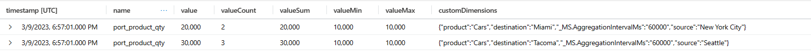
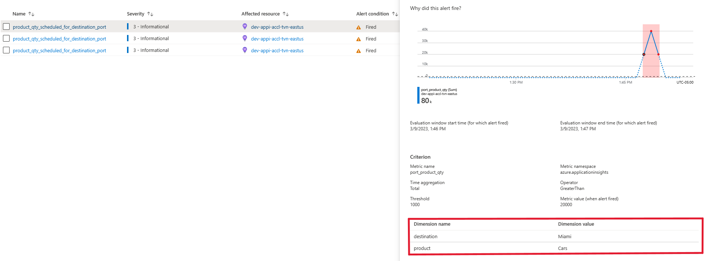

# Custom Metrics

Metrics track key indicators over time and provide a neat, numeric value that can be displayed in a time series, used in alerts, and more. The application tracks a multitude of metrics automatically, like the `jvm_memory_used` metric that measures the number of bytes used by the Java based API services.

Organizations often have additional indicators related to specific business rules or industry-wide ones that are meaningful to track and necessary to understand system health. Custom metrics enable generation of data points over time against these metrics that aren't tracked by default. The application tracks an additional metric, `port_product_qty`, that captures the total quantity of specific products scheduled for shipment to specific ports. Ports do not have unlimited capacity to accept shipping containers. Administrators need to be able to retrieve data on an ad-hoc basis that illuminates product velocity on each port and rely on alerts that proactively notify them when the total shipping container quantity of a given product scheduled for a specific destination port exceeds some value defined by the business.

The `valid-cargo-manager` generates the custom metric as it is the last service to interact with a valid cargo object destined for shipment to a port (invalid cargo objects are simply stored for later processing). It generates a multi-dimensional custom metric, tracking the product quantity, while passing in `product`, `source`, and `destination` dimensions taken from the cargo.

```c#
private void TrackMultiDimensionalMetrics(ValidCargo cargo)
{
    var metric = _telemetryClient.GetMetric("port_product_qty", "product", "source", "destination", _customMetricConfiguration);

    metric.TrackValue(cargo.Product.Quantity,
        cargo.Product.Name,
        cargo.Port.Source,
        cargo.Port.Destination);
}
```

Importantly, the `GetMetric` and `TrackValue` methods pre-aggregate the metric before sending the values every minute. `TrackMetric`, also exposed by the SDK, sends a separate telemetry item every time the method is called and is no longer the preffered approach for generating custom metrics. Rather than generate a new record with a specific value every time the metric is tracked, the service exports an aggregated metric record every minute that includes properties like **value**, **valueCount**, **valueSum**, **valueMin**, and **valueMax**. **valueCount** defines the number of times the metric was tracked over that minute, **valueSum** is the total sum of each of the values, etc.

The custom metric is exported each minute for every specific custom dimension combination. All metric data tracked that includes the same `product`, `source`, and `destination` within the same minute will be grouped together in Application Insights records. If `TrackValue` is called twice within the same minute with `product-Cars, source-New York City, destination-Miami` then they will be grouped together. If, in that same minute `TrackValue` is called with `product-Cars, source-Seattle, destination-Tacoma` then that metric data is exported separately:



The custom metric is exported to Application Insights as both a [log-based and pre-aggregated](https://learn.microsoft.com/en-us/azure/azure-monitor/app/pre-aggregated-metrics-log-metrics) metric. The pre-aggregated version is optimized for time series and enables faster, more performant queries. It _only_ maintains certain dimensions and other specific properties, in contrast with the log-based version that includes all relevant information attached to the record. To ensure that the pre-aggregated metric version has the dimensions we rely on, they must be [enabled via the App Insights resource in the Portal](https://learn.microsoft.com/en-us/azure/azure-monitor/app/pre-aggregated-metrics-log-metrics#custom-metrics-dimensions-and-pre-aggregation) after deployment (currently in Preview and unsupported in ARM).

The alert we employ relies on the `product` and `destination` dimensions within the custom metric, alerting when the total quantity of a given `product` exceeds 1000 for a given `destination` port over a single minute interval. The alert rule maintains different time series for each `product`/`destination` combination and alerts on each separately:



The `source` port is irrelevant. Cars sent to Miami from New York and cars sent to Miami from Boston will roll up together and the total product quantity across both will be used. If `source` was added as a dimension to the alert, for instance, these would be split into two different time series and alerted on separately. The number of ports and products used could quickly inflate the number of time series Azure Monitor maintains, resulting in throttling, reduced system performance, increased cost, etc. By default, Azure Monitor limits metrics to 1000 total time series and 100 unique values per dimension. These values can be customized and set by the TelemetryClient that originally exports the metrics. The `valid-cargo-manager` that instruments the `port_product_qty` custom metric sets series count and values per dimension limits to 100 and 40 respectively, to guard against potential scale issues. The configuration allows for 40 unique destination ports and products, with no more than 100 time series maintained:

```c#
 _customMetricConfiguration = new MetricConfiguration(seriesCountLimit: 100, valuesPerDimensionLimit: 40, new MetricSeriesConfigurationForMeasurement(restrictToUInt32Values: false));
```
