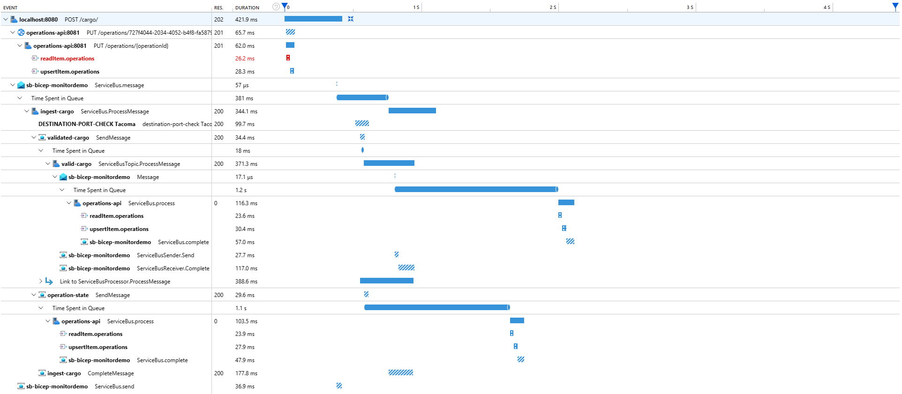
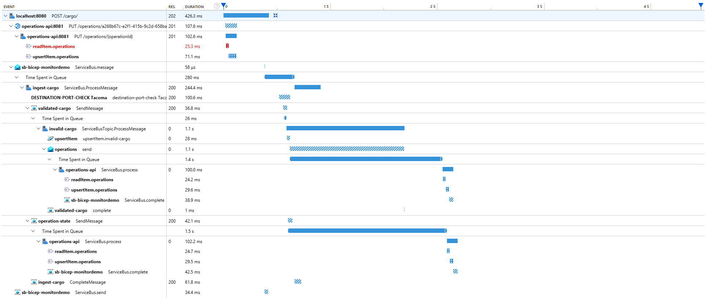

# Distributed Tracing

Distributed tracing depends on careful stitching together of auto and manually instrumented spans from both OpenTelemetry and Application Insights based tooling destined for export to Azure.

## Azure Monitor and OpenTelemetry Data Models

Azure Monitor splits the concept of a generic [OpenTelemetry span](https://opentelemetry.io/docs/concepts/signals/traces/#spans-in-opentelemetry) into a number of specific telemetry items like Requests and Dependencies. Rather than refer to these items as "spans", the term "operation" is heavily used in documentation and tooling. A trace is a distributed logical operation comprised of smaller sub-operations - the Requests, Dependencies, PageViews, etc. In Application Insights, all operations in a distributed trace will share the same `operation_Id` value, while ordering within the trace is defined by `operation_ParentId` values. An operation's `operation_ParentId` will point to the `Id` of another operation in the trace.

OpenTelemetry-based tooling like the OpenTelemetry exporters for Java and the Application Insights SDK for Python (which relies on OpenCensus) use OpenTelemetry span terminology in exposed methods and classes. Spans in these tools encompass all telemetry types and generally expose a [SpanKind](https://opentelemetry.io/docs/concepts/signals/traces/#span-kind) property that dictates the type of item that surfaces in Application Insights. `SpanKind.SERVER` and `SpanKind.CLIENT` spans created in [`invalid-cargo-manager` instrumentation methods](../src/invalid-cargo-manager/src/service/message_receiver.py), for instance, result in export of Request and Dependency items in Application Insights. The `SpanId`, parent `SpanId`, and `TraceId` values in these OpenTelemetry-based libraries surface in Application Insights as `Id`, `operation_ParentId`, and `operation_Id`, respectively.

## Instrumenting the Distributed Trace

### Concepts

The instrumentation process requires generation of operations (spans) with proper attachment of the `operation_Id` and `operation_ParentId` values to ensure they are connected to one another in the same trace, in the correct order.

Each SDK/exporter exposes different methods that allow for creation of operations. The Application Insights SDK for Node [tracks specific operations](https://learn.microsoft.com/en-us/azure/azure-monitor/app/nodejs#telemetryclient-api) using methods like `trackDependency()` and `trackRequest()` on its `TelemetryClient` class. The .NET SDK uses `Activity` classes and [`StartOperation()` calls](https://learn.microsoft.com/en-us/azure/service-bus-messaging/service-bus-end-to-end-tracing?tabs=net-standard-sdk-2#trace-message-processing) exposed by its own `TelemetryClient` class to do the same. The OpenCensus based Python OpenTelemetry exporter, on the other hand, enables [creation of spans](https://learn.microsoft.com/en-us/azure/azure-monitor/app/opentelemetry-enable?tabs=python#instrument-with-opentelemetry) via a Tracer. No spans are manually instrumented in either of the Java-based APIs, but the libraries do [expose the functionality](https://learn.microsoft.com/en-us/azure/azure-monitor/app/opentelemetry-enable?tabs=java#add-custom-spans) to generate them, if necessary.

In order for one service's operations to be properly tied to an operation from an upstream service, a trace context must be passed between them. OpenTelemetry based tooling uses the widely recognized [W3C Trace Context](https://www.w3.org/TR/trace-context/#trace-context-http-headers-format) as a means to pass the required values and Application Insights is transitioning to use the same. W3C Trace Context defines a `traceparent` string that contains the Id values necessary to set a telemetry item's `operation_Id` and `operation_ParentId`. It uses the following syntax:

`<version>-<trace-id>-<parent-id>-<trace-flags>`

The `<trace-id>` value is uniquely generated by the first service in the distributed trace and becomes the `operation_Id` in Application Insights. The `<parent-id>` value refers to the `Id` of the most recent operation in the trace and becomes the `operation_ParentId` property for the next operation. When an upstream service makes a request or sends a message to a downstream service, it attaches the `traceparent` string in the manner dictated by the [communication protocol](https://www.w3.org/TR/trace-context-protocols-registry/#registry). Services that communicate via HTTP, like the inter-service communication between the `cargo-processing-api` and `operations-api` pass the string in the request headers, while services that communicate via message brokers, like all other inter-service communications in the application, pass the value in the message's application properties.

### Implementation

A distributed trace begins when a POST request is made to the `cargo-processing-api` service. The initial request is automatically instrumented and generates the `operation_Id` that will be attached to all subsequent telemetry items. The service makes a PUT request to the `operations-api` and automatically attaches the `traceparent` value in the headers, passing in the `operation_Id` and the `Id` of the last instrumented item. The last instrumented item in this case is the Dependency generated by the `cargo-processing-api` which refers to the PUT request. The `operations-api` similarly auto-instruments its own subsequent span data that is tied into the trace. It breaks open the `traceparent` string and uses the values to set trace context for the spans it will instrument. The initial span auto-instrumented by the `operations-api` when the PUT request is made surfaces as a Request, while other spans that refer to Cosmos DB interactions become Dependencies in Application Insights.

When the `cargo-processing-api` receives a response back from the `operations-api`, it sends a message to the `ingest-cargo` Service Bus queue. The `traceparent` string is automatically passed by the service in the message's application properties and is received by the `cargo-processing-validator`. The `<parent-id>` value passed in the `traceparent` that becomes the `operation_ParentId` now refers to the message send Dependency item generated by the `cargo-processing-api`. The first operation produced by the `cargo-processing-validator` must be parented to this value. The service pulls the necessary `operation_Id` and `operation_ParentId` from the `traceparent` and uses the values in [pre-processor functionality](../src/cargo-processing-validator/src/index.ts) to attach the proper `operation_ParentId` to telemetry items prior to export. After manually instrumenting a request and a number of dependencies related to Service Bus operations and custom business logic, the `cargo-processing-validator` service sends a message to the `validated-cargo` Service Bus Topic. The `traceparent` string is again passed in the message's application properties. While the Java API services automatically attach the `traceparent` string, the `cargo-processing-validator` attaches the value [manually](../src/cargo-processing-validator/src/services/ServiceBusWithTelemetry.ts) in a `Diagnostic-Id` property.

The `valid-cargo-manager` and `invalid-cargo-manager` are both prepared to pull the `operation_Id` and `operation_ParentId` values from the `Diagnostic-Id`. The `valid-cargo-manager` uses the values to [manually instrument a request](../src/valid-cargo-manager/Services/SubscriptionReceiver.cs), then begins automatically instrumenting Cosmos DB and Service Bus operations. The `invalid-cargo-manager` does the same to manually instrument a request, but follows with a [series of manually instrumented dependencies](../src/invalid-cargo-manager/src/service/message_receiver.py) that refer to the same Cosmos DB and Service Bus operations.

## Visualization and Analysis

The generated distributed traces through the valid and invalid flows are easily viewable in the Application Insights [Transaction Diagnostics window](https://learn.microsoft.com/en-us/azure/azure-monitor/app/transaction-diagnostics#transaction-diagnostics-experience):

Transaction Diagnostics displays a distributed trace's individual components with their timing and success properties. It is a visual representation of a KQL query that pulls all operation data associated with a specific `operation_Id`. The interface quickly reveals where issues arose within a specific trace. Inspecting individual traces is a helpful debugging tool, especially combined with correlated logs that provide some additional level of detail about why an operation may have failed.

Aggregated trace data allows for construction of an application topology, visible within the [Application Map](https://learn.microsoft.com/en-us/azure/azure-monitor/app/app-map?tabs=net), and supports a number of monitoring functionalities that the application relies on. Using operation timing and failure properties, performance data can be quickly retrieved and filtered by service, helping to identify which components in the application may be experiencing failure or performance issues. Combined, they enable retrieval of end to end transaction duration. KQL queries that pull end to end and per-service failure and performance data are heavily used in Workbooks and automated Alert rules.
