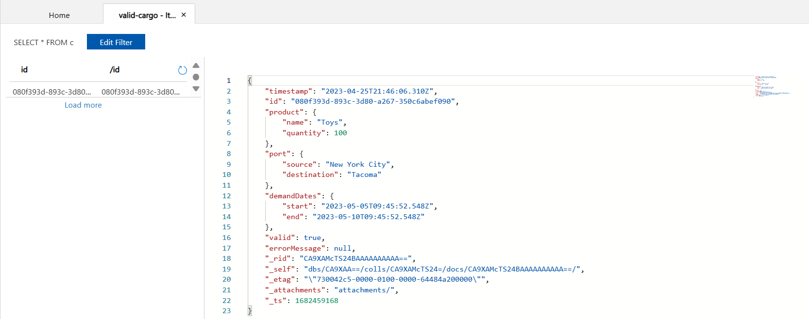
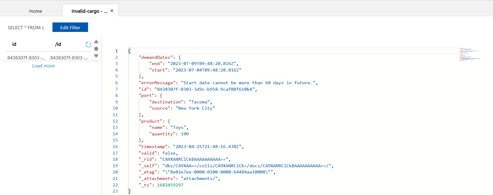

# Getting Started

## Prerequisites

Visual Studio Code and dev containers are used to automatically install the required packages necessary to deploy and run the application. To get started, you will need to have the following installed:

- Docker ([link](https://docs.docker.com/get-docker/))
- Visual Studio Code ([link](https://code.visualstudio.com/download))
  - Dev Containers extension ([link](https://marketplace.visualstudio.com/items?itemName=ms-vscode-remote.remote-containers))

Alternatively, you can deploy and run the application from your local machine but will need to have the following additionally installed:

- Azure CLI ([link](https://learn.microsoft.com/en-us/cli/azure/install-azure-cli))
- Azure Kubelogin ([link](https://github.com/Azure/Kubelogin))
- Kubectl ([link](https://kubernetes.io/docs/reference/kubectl/))
- Helm ([link](https://helm.sh/))
- Various command line tools ([figlet](http://www.figlet.org/), [jq](https://stedolan.github.io/jq/))

## Running the Application

Open the repository in Visual Studio Code. If you have the DevContainer extension installed, you will be prompted to "Reopen in Container" to work using the DevContainer.

Copy the `.env.sample` file to `.env` and fill in the required values.

The sample uses either Bicep or Terraform to provision the required infrastructure. Run `./deploy-bicep.sh` to deploy the application to Azure using Bicep, or `./deploy-terraform.sh` to do so using Terraform. The scripts will create the required resources in Azure, build the docker images, push them to Azure Container Registry and deploy the containers to Azure Kubernetes Service (AKS).

By default, the AKS cluster is deployed without AAD integration. To enable AAD integration, pass the `--aks-aad-auth` switch to the deployment script. This will configure authentication for the current `az` user. To configure for a service principal, set the `ARM_CLIENT_ID` value to the client ID for the service principal.

> **_NOTE:_** If you are running ARM architecture (Mac M1 or M2) to ensure images are built using the correct platform set `DOCKER_DEFAULT_PLATFORM=linux/amd64`.

## Sending Requests

After deploying the application, you can use the [`cargo-processing-api.http`](../http/cargo-processing-api.http) file to send requests to it.

The file contains a number of requests that can be sent to the cargo-processing-api service. It uses an `.env` file generated by the deployment script that contains the IP address of the AKS NGINX ingress controller.

Use the "Send Request" options in the file to send `POST`/`PUT` requests to the cargo-processing-api and see the responses.

> **_NOTE:_** By default, the `cargo-processing-api.http` file is configured to use services deployed to AKS. If you are running the services locally, uncomment the lines that set the service address to `localhost`.

## Verifying Successful Deployment

A cargo object sent to the `cargo-processing-api` service can take one of two paths depending on the validation result from the `cargo-processing-validator` service. The first path, when the cargo is valid, incorporates the `cargo-processing-api`, `operations-api`, `cargo-processing-validator` , and `valid-cargo-manager` services and results in a record being stored in the `valid-cargo` Cosmos DB container. An invalid piece of cargo reaches the `invalid-cargo-manager` rather than the `valid-cargo-manager` service and is stored in the `invalid-cargo` Cosmos DB container. End to end functionality can be verified by sending a request through both flows and ensuring that the cargo objects are stored in the proper Cosmos DB containers.

The [`cargo-processing-api.http`](../http/cargo-processing-api.http) file contains `createRequest` and `createRequest_invalid` requests that are used to send a valid and invalid cargo object to the `cargo-processing-api` service, respectively. Use the "Send Request" option on `createRequest` to send a valid request and note the ID returned in the right-hand window (`080f393d-893c-3d80-a267-350c6abef090` in the below example).

```json
HTTP/1.1 202
Date: Tue, 25 Apr 2023 21:46:07 GMT
Content-Type: application/json
Transfer-Encoding: chunked
Connection: close
operation-id: 49d8f01c-a284-44b4-8c97-605d224016af

{
  "id": "080f393d-893c-3d80-a267-350c6abef090",
  "timestamp": "2023-04-25T21:46:06.310Z",
  "product": {
    "name": "Toys",
    "quantity": 100
  },
  "port": {
    "source": "New York City",
    "destination": "Tacoma"
  },
  "demandDates": {
    "start": "2023-05-05T09:45:52.548Z",
    "end": "2023-05-10T09:45:52.548Z"
  }
}
```

The subsequent request in the `.http` file can be used to retrieve the status of that request. Next, use the "Send Request" option on `createRequest_invalid` to send a invalid request and note the ID returned in the right-hand window (`8438307f-8303-3d9c-b958-9caf08f610b4` in the below example).

```json
HTTP/1.1 202
Date: Tue, 25 Apr 2023 21:48:16 GMT
Content-Type: application/json
Transfer-Encoding: chunked
Connection: close
operation-id: 9d3bdc2f-a4aa-45e5-8965-d9e53716c1e7

{
  "id": "8438307f-8303-3d9c-b958-9caf08f610b4",
  "timestamp": "2023-04-25T21:48:16.438Z",
  "product": {
    "name": "Toys",
    "quantity": 100
  },
  "port": {
    "source": "New York City",
    "destination": "Tacoma"
  },
  "demandDates": {
    "start": "2023-07-04T09:48:20.816Z",
    "end": "2023-07-09T09:48:20.816Z"
  }
}
```

Finally, navigate to the Cosmos DB instance's Data Explorer window and verify that a new record has been added to both the `valid-cargo` and `invalid-cargo` containers with IDs and other properties that match the ones copied earlier.




## Local Development

To run the services locally, you still need to deploy the supporting infrastructure in Azure. You can run the deployment scripts described in the [Running the Application](#running-the-application) section, but pass the `--skip-helm-deploy` switch to skip the Helm deployment of services to AKS. This will ensure that the services you run locally will be the only services retrieving messages from the Service Bus queues etc.

After the infrastructure deployment completes, run `run-local.sh` to start all of the services locally via `docker compose`. To run a service individually, open it in its dev container and follow the instructions provided in the service's README.
