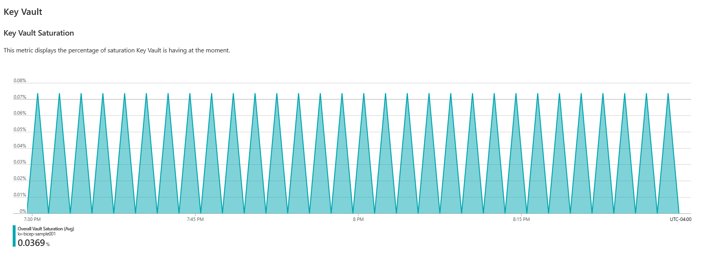

# Workbooks

The application utilizes Azure Workbooks to visualize/analyze the extensive telemetry data that has been captured by the centralized Azure Monitor backend. Workbooks allow you to seamlessly display and track all relevant configured data within the Azure Portal, without the need to navigate away.

Workbooks can be deployed using infrastructure as code tools, similar to other Azure services. In this scenario, the deployment creates three distinct workbooks, each focusing on specific categories that feature the following charts:

| Workbook          | Chart                            | Type      | Description                                                                                       |
| ----------------- | -------------------------------- | --------- | ------------------------------------------------------------------------------------------------- |
| Index             | servicesExceptionsQuery          | KQL Query | Displays exceptions that ocurred while working with the system.                                   |
| Index             | servicesMonitoringQuery          | KQL Query | Displays the big picture of resources per service.                                                |
| Index             | workbooksLinksText               | Text      | Includes the links to access to remaining workbooks.                                              |
| Infrastructure    | serviceBusCompletedTimesQuery    | KQL Query | Displays statistics of service bus completed operations.                                          |
| Infrastructure    | serviceBusMessagingMetric        | Metric    | Displays the count of active, delivered and dead-lettered messages in a Queue or Topic.           |
| Infrastructure    | serviceBusThrottledMetric        | Metric    | Displays the number of throttled requests in Service Bus.                                         |
| Infrastructure    | cosmosDbLatencyOfReadsQuery      | KQL Query | Displays the average time per read requests from Cosmos DB.                                       |
| Infrastructure    | cosmosDbOperationsQuery          | KQL Query | Displays the number of valid, invalid, and operations writes into CosmosDB.                       |
| Infrastructure    | keyVaultSaturationMetric         | Metric    | Displays the KeyVault saturation percentage.                                                      |
| Infrastructure    | keyVaultLatencyMetric            | Metric    | Displays the latency when executing an operation to KeyVault.                                     |
| Infrastructure    | keyVaultResultsMetric            | Metric    | Displays the count of Key Vault API Results.                                                      |
| Infrastructure    | aksCpuMetric                     | Metric    | Displays the max count of CPU percentage of the cluster.                                          |
| Infrastructure    | aksRequestsMetric                | Metric    | Displays the average inflight requests to the cluster.                                            |
| System processing | endpointsRequestsStatisticsQuery | KQL Query | Displays different measures for time per requests.                                                |
| System processing | endpointsRequestsQuery           | KQL Query | Extracts the last column from previous chart in order to gain more focus.                         |
| System processing | lastOperationsQuery              | KQL Query | Shows the last 100 operations executed and their associated operation ID.                         |
| System processing | transactionSearchBladeText       | Text      | Link to a transaction search blade.                                                               |
| System processing | additionalTelemetryText          | Text      | Link to get more telemetry in sections like Application Map, Availability, Failures, Performance. |
| System processing | operationsParameters             | KQL Query | Parameters designed to get more details in the following charts.                                  |
| System processing | endToEndProcessingQuery          | KQL Query | Displays the end to end processing time.                                                          |
| System processing | requestsCountQuery               | KQL Query | Displays the request count.                                                                       |
| System processing | servicesProcessingTimeQuery      | KQL Query | Displays the processing time in the services.                                                     |
| System processing | serviceDependencyQuery           | KQL Query | Displays the service dependency duration.                                                         |
| System processing | destinationPortBreakdownQuery    | KQL Query | Displays the end to end processing time by destination port.                                      |
| System processing | podRestartQuery                  | KQL Query | Displays the number of times each service pod has restarted.                                      |

No matter what infrastructure deployment tool is used, workbooks content is supplied via the same set of **json** templates, found in the [workbooks](../infrastructure/workbooks/) folder. The templates demonstrate proper workbook structure/syntax and include a variety of types of visualization items [available for use in workbooks](https://learn.microsoft.com/en-us/azure/azure-monitor/visualize/workbooks-visualizations), like text and charts. The templates also illustrate how to pass required parameters from Bicep and Terraform to the workbooks json content, like the IDs of the source resources for log query and metric visualizations. In the following snippet, a metric chart receives the ID of the AKS cluster and uses it in the **resourcesIds** field.

```json
{
  "type": 10,
  "content": {
    "chartId": "workbook171b383f-5043-41dd-9154-a1fa92367891",
    "version": "MetricsItem/2.0",
    "size": 0,
    "showAnalytics": true,
    "chartType": 3,
    "color": "pink",
    "resourceType": "microsoft.containerservice/managedclusters",
    "metricScope": 0,
    "resourceIds": ["${aks_id}"],
    "timeContext": {
      "durationMs": 3600000
    },
    "metrics": [
      {
        "namespace": "microsoft.containerservice/managedclusters",
        "metric": "microsoft.containerservice/managedclusters-Nodes (PREVIEW)-node_cpu_usage_percentage",
        "aggregation": 3,
        "splitBy": null
      }
    ],
    "gridSettings": {
      "rowLimit": 10000
    }
  },
  "name": "aksCpuMetric"
}
```

Development teams can adapt the workbook presentation according to how they want to visualize data. Chart colors, for instance, can be used to visually separate the tools they are monitoring, allowing for easy identification what resource and signal is being observed:




Azure Workbooks can provide a dynamic presentation that captures all relevant data in one single visualization tool, enabling creation of a single pane of glass for application administrators. Not all projects will look for the same telemetry, as each solution will focus on different metrics according to their specific needs.
